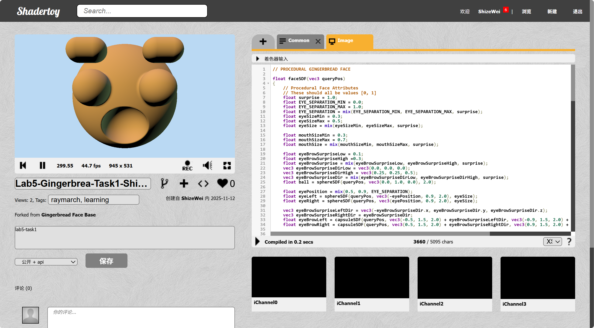
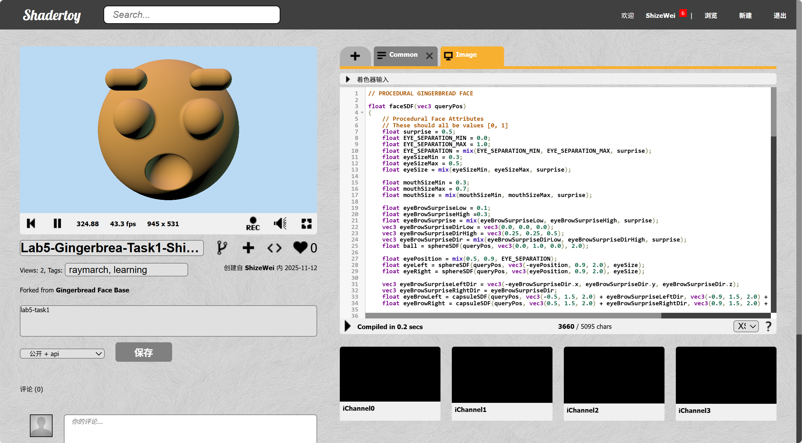
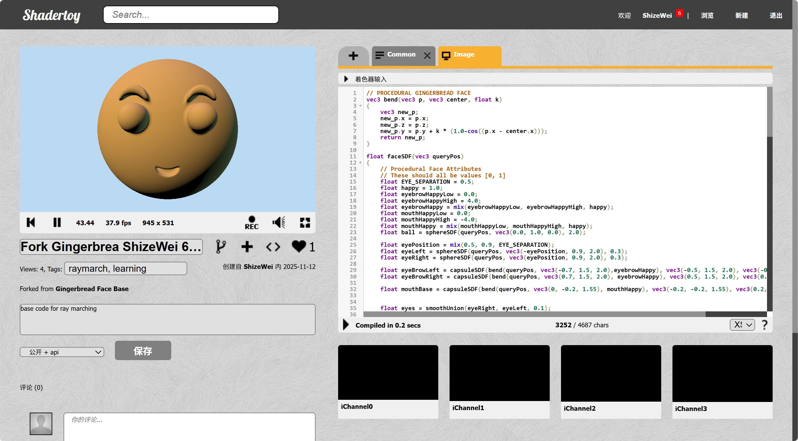

# lab06-proceduralFace

I did the procedural surprise face and a happy/sad face.

For the surprise face I simply change the radius and position of the eyebrow, distance between the eyes and the size of the mouth.
It looks quite funny for me.

And for the sad and happy face I just bend the eyebrow and mouth on the opposite position. The parameter controls the bend rate. When it's -0 to -1 it's a sad face.

